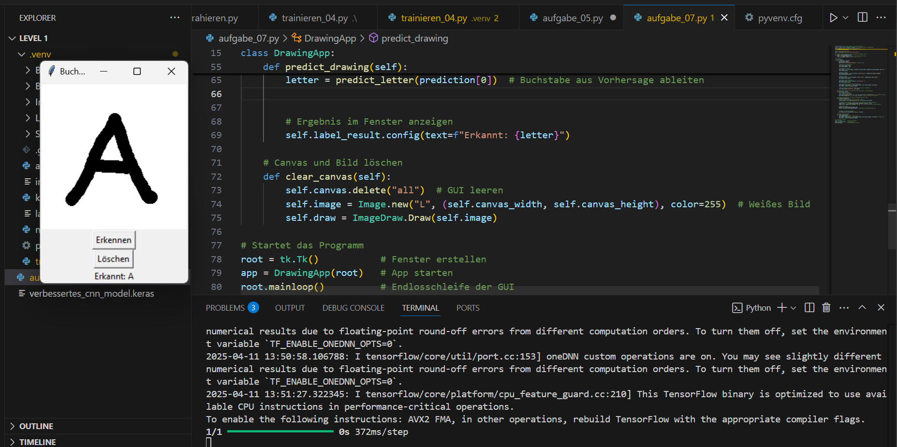

# 🧠 Buchstaben-Erkennung mit CNNs (KI-Projekt HTL Anichstraße)

## 📋 Projektübersicht

Dieses Projekt befasst sich mit der Entwicklung eines KI-Systems zur Erkennung handgeschriebener Blockbuchstaben (A–Z). Es kombiniert Datensatz-Erstellung, Bildverarbeitung, ein Convolutional Neural Network (CNN), sowie eine grafische Benutzeroberfläche zur interaktiven Erkennung gezeichneter Buchstaben.

---

## 📁 Projektstruktur

```
.
├── aufgabe_05.py                # Manuelle Testfunktion zur Vorhersage mit Modell
├── aufgabe_07.py                # GUI zur Buchstabeneingabe und Vorhersage
├── trainieren_04.py            # Haupttraining mit CNN und Augmentation
├── modell_trainieren_03.py     # Basis-Bilddatenvorbereitung (50x50)
├── verbessertes_cnn_model.keras # Gespeichertes, trainiertes CNN-Modell
├── GUI_screenshot.png          # Screenshot der Zeichen-GUI
├── Arbeitsauftrag_Schrifterkennung.odt # Offizieller Arbeitsauftrag
```

---

## 🧪 Features

- ✍️ Zeichnen von Buchstaben über eine grafische Oberfläche (`tkinter`)
- 🧠 Klassifikation der Buchstaben von A–Z mit einem CNN
- 🎓 Training mit erweiterten Techniken wie Data Augmentation
- 💾 Modell-Export/Import mit `Keras`
- 🔍 Manuelle Überprüfung der Modellqualität

---

## 🛠️ Setup & Installation

1. **Python 3.10+**
2. Abhängigkeiten installieren:

```bash
pip install tensorflow numpy opencv-python pillow scikit-learn
```

3. Starte die GUI:

```bash
python aufgabe_07.py
```

---

## 🖥️ GUI (Screenshot)



---

## 🧬 Trainingsdaten

- Bilder wurden in einer Ordnerstruktur `A/`, `B/`, ..., `Z/` gespeichert.
- Bilder wurden auf **28x28 Pixel** skaliert und normalisiert (Graustufen).
- Labels entsprechen dem Alphabet: A = 0, B = 1, ..., Z = 25

---

## ⚙️ Modelltraining

Trainiert wurde ein **Convolutional Neural Network (CNN)** mit:

- 3 Conv-Blöcken (jeweils mit BatchNorm, LeakyReLU, MaxPooling)
- Dense Layer + Dropout zur Vermeidung von Overfitting
- Data Augmentation: Rotation, Verschiebung, Zoom

Modell speichern:

```python
model.save("verbessertes_cnn_model.keras")
```

---

## 🔍 Manuelle Testfunktion

In `aufgabe_05.py` wird das Modell auf einem Testset geprüft. Ausgabe:

```
Bild 1: Richtig = B, Vorhersage = B
Bild 2: Richtig = T, Vorhersage = T
...
```

---

## 🧠 Modellnutzung (GUI)

1. Buchstaben im weißen Fenster zeichnen
2. Auf **"Erkennen"** klicken → Vorhersage erscheint
3. **"Löschen"** löscht die Eingabe

---

## 💡 Erweiterungsmöglichkeiten

- Mehr Datensätze und Varianten (Level 2)
- Verbesserung der GUI mit Wahrscheinlichkeitsanzeige
- Integration eines Feedback-Systems zur Korrektur

---

## 📚 Quellen & Inspiration

- TensorFlow Tutorials (Fashion MNIST, CNNs, Data Augmentation)
- Label Studio: https://labelstud.io/
- `cv2`, `numpy`, `tkinter`, `tensorflow.keras`

---

## ✍️ Autor

Schüler: *[Dein Name hier]*  
HTL Anichstraße – Schuljahr 2024/25  
Fach: Künstliche Intelligenz – Projektarbeit
